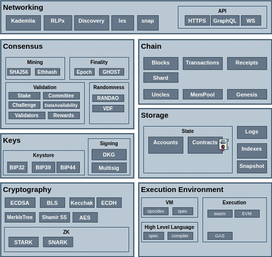

# Blockchain RnD

Diagrams, Snippets, research

1. [architecture](architecture) - Architectural Diagrams
2. [security](security) - Security Related collection
3. [wallet](wallet) - Wallets and Keystores
4. [auth](auth) - Authentication and Authorization
5. [L2 StarkNet](starknet) - L2 StarNet
6. [L2 ZkSync](zksync) - L2 ZkSync
#. [covid](covid) - Covid-Pass infra

---

## Credits

Icons - [https://www.flaticon.com/](https://www.flaticon.com/)

