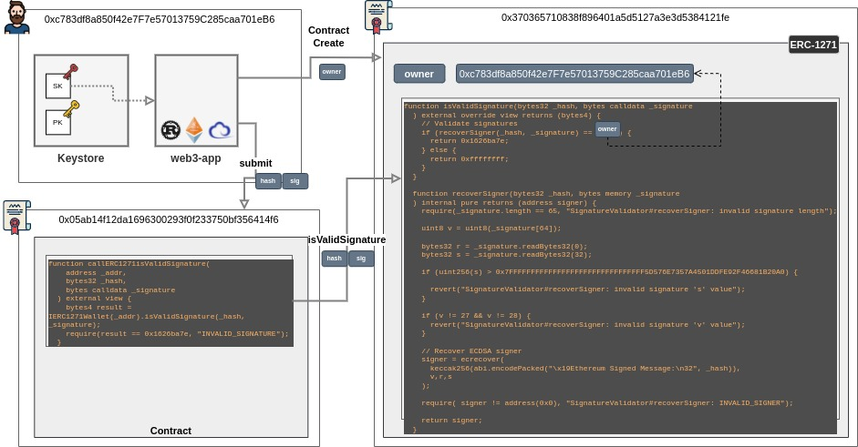
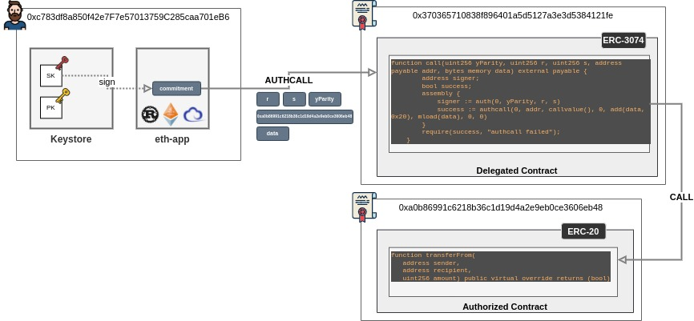

# Authentication and Authorization

Diagrams, Snippets, research

 

## EIP-1271

Contract Originated Authentication

[https://eips.ethereum.org/EIPS/eip-1271](https://eips.ethereum.org/EIPS/eip-1271)

---

## EIP-3074

Account delegated Contract initiated transaction via AUTHCALL opcode

[https://eips.ethereum.org/EIPS/eip-3074](https://eips.ethereum.org/EIPS/eip-3074)

