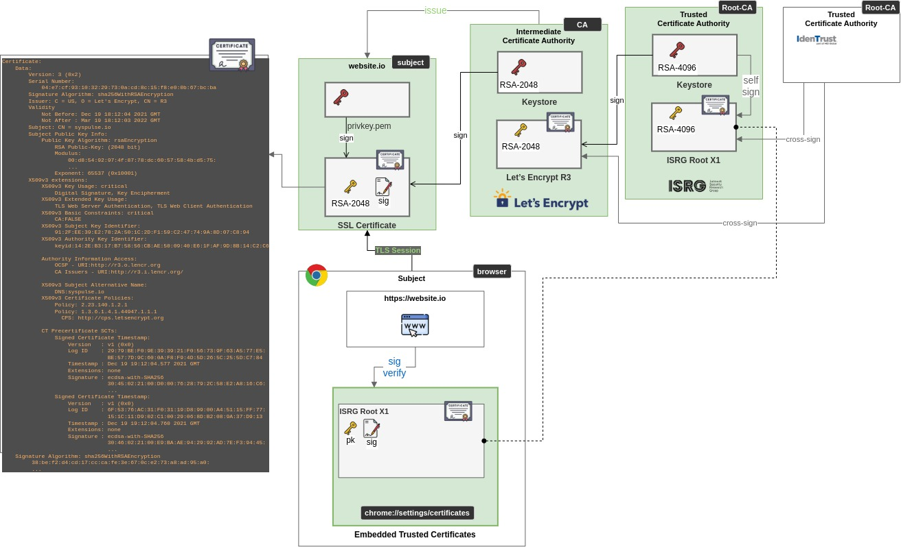
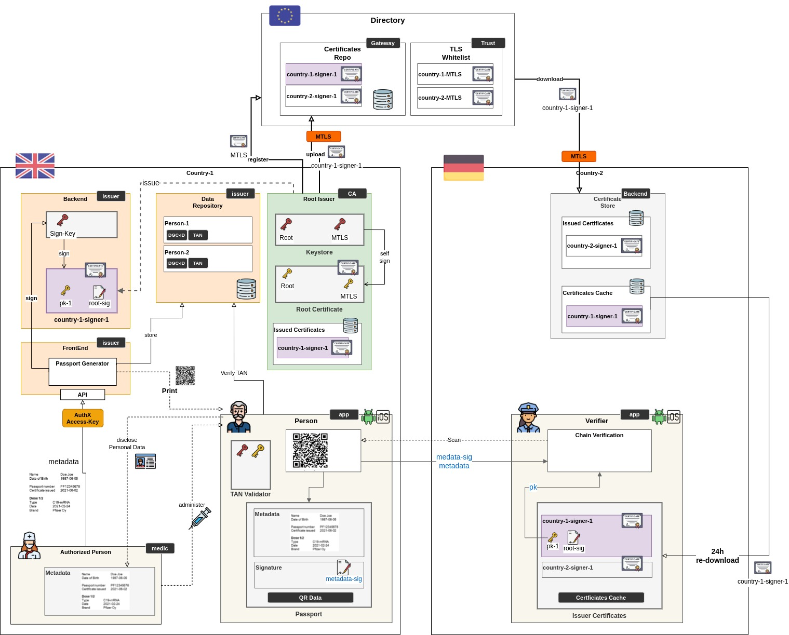
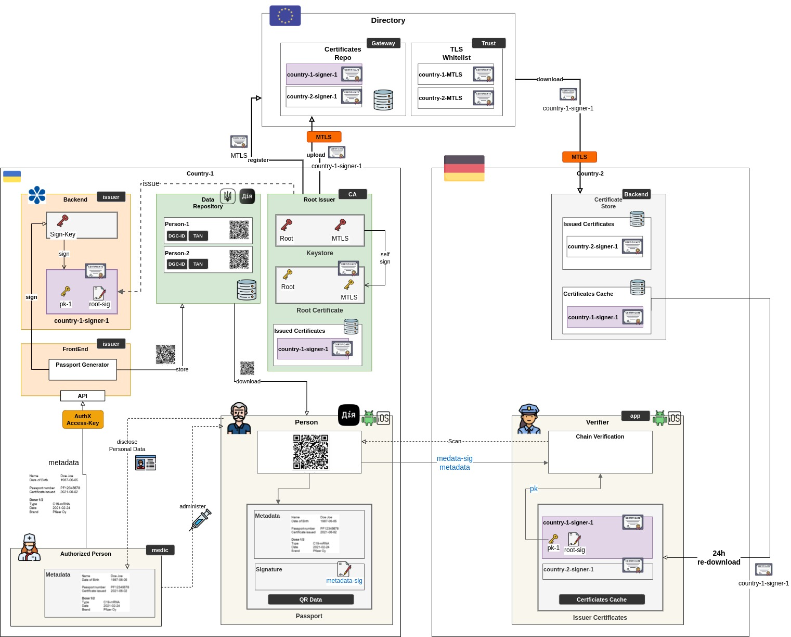

# PII Architectures

Diagrams, Snippets, research around PII Distributed Information

## Certificate Chain for TLS

The backbone for Internet trust

---
# Covid-Passport Architectures

## EU Architecture (no PII sharing)

PII data is supposed to never leave Testing Facility FrontEnd application and after generating ID and TAN, the QR data (which contains PII) mutst be:

1. printed and given physically to user
2. sent to user via email
2. erased from FrontEnd

## Shared PII Architecture

PII data sharing with User's Consent

1. PII data is stored on state repository with ID (TAN is not needed)
2. User app syncs with Repository and downloads QR. 
3. No TAN User Keypair is needed to validate
4. User validation is done by State App in different flow (BankId, Tax Service certificate)

----

