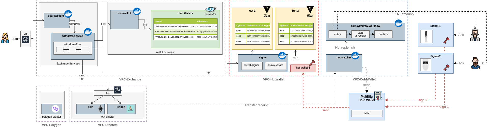
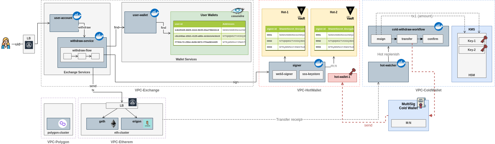

# Custody and Keystores

Diagrams, Snippets, research

 

Custody Solutions with an additional emphasis on security 

## Custody Solution with HW Wallets workflow

The case is applicable both for Custody and Exchange Services

Cold storage is Multisig Wallet for additional security (secured by Blockchain itself)

 

## Custody Solution with HSM KMS Solution

Cold storage is Multisig Wallet and all Hot-Cold interaction is automated.

Integration with Human additional signature is easily integratable

HSM must support cryptography primitive

 

__MultiSig Wallet Contracts:__

1. [Gnosis Safe](https://gnosis-safe.io/)

__Open Questions__

1. MultiSig Wallet Contract creation ECDSA key. Key must be destroyed or Contract should be created with aggregatable  multi-signature (not supported with ECDSA)

2. Hardware Wallets on-chain vs. off-chain signatures (like Gnosis approach)

----

