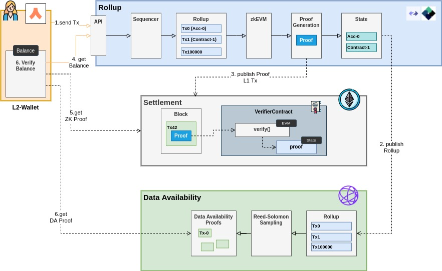

# Modular L1-L2 Architecture

 

## ZK-Rollup + Data Availability Layers

L1 Layer in Rollup-world does not store L2 state (e.g. L2 balances, L2-Contract data)

Currently, all Rollup Solutions are highly centralized and not-trusted. 
It seems that there are no immediate plans to have a decentralized L2 network, especially for ZK (complex infra, novel cryptography, high requirements for fast proof generation)

Data Availability layers (e.g. Celestia) adds light-weight Data verification for light clients (like Wallets) in a trustless way so that if L2 generates __valid proofs__ on __invalid data__ (e.g. transferring assets of different amount)

There is an incentive for Zk-Rollup to publish state (data) not to design this layer and concentrate on Execution
 
