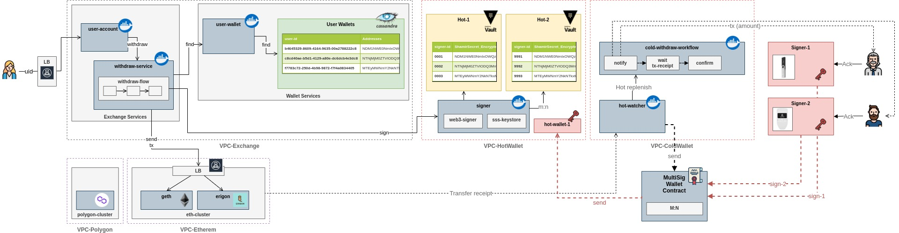

# Wallet and Keystores

Diagrams, Snippets, research

 

## Hot-Cold Wallet

Some Ideas around Hot-Cold Wallet Architecture.

It is applicable to use case like Exchange or Custody

 

__MultiSig Wallet Contracts:__

1. [Gnosis Safe](https://gnosis-safe.io/)

__Open Questions__

1. MultiSig Wallet Contract creation ECDSA key. Key must be destroyed or Contract should be created with aggregatable  multi-signature (not supported with ECDSA)

2. Hardware Wallets on-chain vs. off-chain signatures (like Gnosis approach)

----

